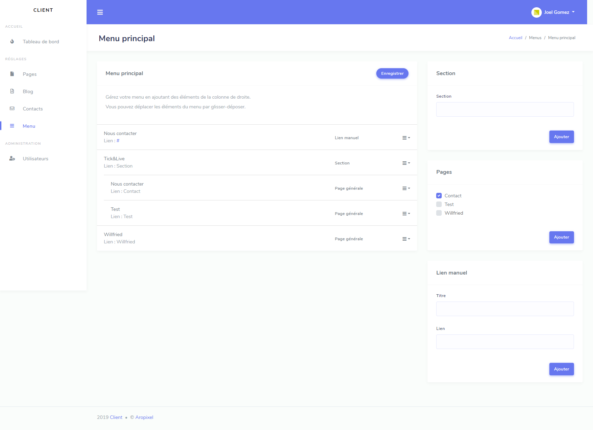

  

<h1 align="center">Aropixel Menu Bundle</h1>

  Aropixel Menu Bundle is a complementray bundle of <a href="https://github.com/aropixel/admin-bundle">Aropixel Admin Bundle</a>. It gives possibility to manage menus (main menu, footer, ...) of your website.   

 

## Table of contents

- [Quick start](#quick-start)
- [License](#license)

## Quick start

- Create your symfony 4 project & install Aropixel AdminBundle
- Require Aropixel Menu Bundle : `composer require aropixel/menu-bundle`
- Apply migrations
- Include the routes

## License
Aropixel Menu Bundle is under the [MIT License](LICENSE)
